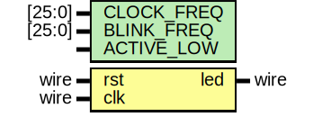

# Entity: timer 
- **File**: timer.v
- **Title:**  LED Blinker Timer
- **Author:**  Muhammad Shofuwan Anwar

## Diagram

## Description

This module generates a square wave by toggling an LED output based on a counter.
The counter resets when it reaches `THRESHOLD = CLOCK_FREQ / BLINK_FREQ`.

Here's the waveforms output for better visualization

 

## Generics

| Generic name | Type    | Value      | Description                   |
| ------------ | ------- | ---------- | ----------------------------- |
| WIDTH        | integer | 26         |                               |
| CLOCK_FREQ   | integer | 50_000_000 | external crystal oscillator   |
| BLINK_FREQ   | integer | 1          | blinking frequency rate in Hz |

## Ports

| Port name | Direction | Type | Description                               |
| --------- | --------- | ---- | ----------------------------------------- |
| rst       | input     | wire | reset pin for clearing the register value |
| clk       | input     | wire | clock source pin                          |
| led       | output    |      | led output pin                            |

## Signals

| Name        | Type            | Description                                    |
| ----------- | --------------- | ---------------------------------------------- |
| counter = 0 | reg [WIDTH-1:0] | register to count clock cycles up to threshold |

## Constants

| Name      | Type | Value                   | Description                                                                  |
| --------- | ---- | ----------------------- | ---------------------------------------------------------------------------- |
| THRESHOLD |      | (CLOCK_FREQ/BLINK_FREQ) | The *THRESHOLD* constant defines the number of clock cycles per toggle event |

## Processes
- counter_reg: ( @(posedge clk or posedge rst) )
  - **Type:** always
  - **Description**
  This always block continously incrementing the counter register  until it's reach the *THRESHOLD* value. Afterwards, the counter  will be reset and the led is toggled. 
