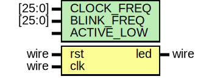

# Entity: timer 
- **File**: timer.v
- **Title:**  LED Blinker Timer
- **Author:**  Muhammad Shofuwan Anwar

## Diagram

## Description

This module generates a square wave by toggling an LED output based on a counter.
The counter resets when it reaches `THRESHOLD = CLOCK_FREQ / BLINK_FREQ`.

Here's the waveforms output for better visualization

 

## Generics

| Generic name | Type   | Value          | Description                               |
| ------------ | ------ | -------------- | ----------------------------------------- |
| CLOCK_FREQ   | [25:0] | 26'd50_000_000 | 50MHz default external crystal oscillator |
| BLINK_FREQ   | [25:0] | 26'd1          | blinking frequency rate in Hz             |
| ACTIVE_LOW   |        | 1'b1           | active low led mode as default setting    |

## Ports

| Port name | Direction | Type | Description                               |
| --------- | --------- | ---- | ----------------------------------------- |
| rst       | input     | wire | reset pin for clearing the register value |
| clk       | input     | wire | clock source pin                          |
| led       | output    | wire | led output pin                            |

## Signals

| Name                                | Type       | Description                                                    |
| ----------------------------------- | ---------- | -------------------------------------------------------------- |
| counter = 26'b0                     | reg [25:0] | 26-bit register to count clock cycles up to threshold          |
| comparator = (counter >= THRESHOLD) | wire       | comparator to check if the counter already reach the threshold |

## Constants

| Name      | Type | Value                   | Description                                                                  |
| --------- | ---- | ----------------------- | ---------------------------------------------------------------------------- |
| THRESHOLD |      | (CLOCK_FREQ/BLINK_FREQ) | The *THRESHOLD* constant defines the number of clock cycles per toggle event |

## Processes
- counter_reg: ( @(posedge clk or posedge rst) )
  - **Type:** always
