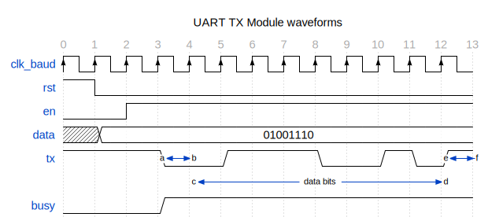

# Entity: uart_tx 
- **File**: uart_tx.v
- **Title:**  UART TX Module
- **Author:**  Muhammad Shofuwan Anwar

## Diagram

## Description

This module is used to transmit `8-bit` data via UART communications protocol.
State machine in this module are consist of 4 states. Which is started on `IDLE`,
and continue to `START_BIT` when the `en` is capturing a *high* logic. In this state
UART sending *low* as a starting bit, and afterwards continue to sending the data
bits by changing the state to `DATA_TRANSMIT`. Transmitting the 8-bits LSB one-by-one via tx
pin until the counter reach `4'd8`. After hit the last data index, state changed to `STOP_BIT`.
In this state, UART send *high* logic to indicate the communication was ended. You can see
on the waveforms below, how UART send *'N'* (8'd78) character over tx pin.

 

## Ports

| Port name | Direction | Type       | Description                                                       |
| --------- | --------- | ---------- | ----------------------------------------------------------------- |
| clk_baud  | input     | wire       | clock input from top module                                       |
| rst       | input     | wire       | reset the register value                                          |
| en        | input     | wire       | start/enable the uart transmitter                                 |
| data      | input     | wire [7:0] | 8-bit data that will be transmitted                               |
| tx        | output    |            | data transmitter pin                                              |
| busy      | output    |            | flag indicating data transmission in progress (includes stop bit) |

## Signals

| Name       | Type      | Description                                                    |
| ---------- | --------- | -------------------------------------------------------------- |
| state      | reg [1:0] | 2-bit register to hold the state machine                       |
| next_state | reg [1:0] | 2-bit register to hold the state machine                       |
| counter    | reg [3:0] | 4-bit counter to access every bits in the data (count until 8) |
| data_buf   | reg [7:0] | buffer to hold the data, make it stable for the process        |

## Constants

| Name          | Type | Value | Description                                             |
| ------------- | ---- | ----- | ------------------------------------------------------- |
| IDLE          |      | 2'd0  | idle state, default tx=1                                |
| START_BIT     |      | 2'd1  | sending start bit to begin the uart communication       |
| DATA_TRANSMIT |      | 2'd2  | transmitting the data                                   |
| STOP_BIT      |      | 2'd3  | stop bit to end the uart communication, by sending tx=1 |

## Processes
- data_counter: ( @(posedge clk_baud or posedge rst) )
  - **Type:** always
  - **Description**
  register to keep the scheduler state 
- uart_state_machine: ( @(*) )
  - **Type:** always
  - **Description**
  UART TX state machine 
